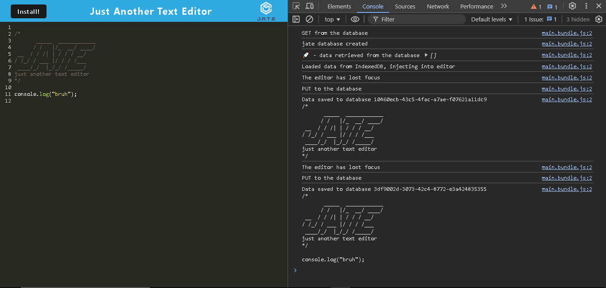
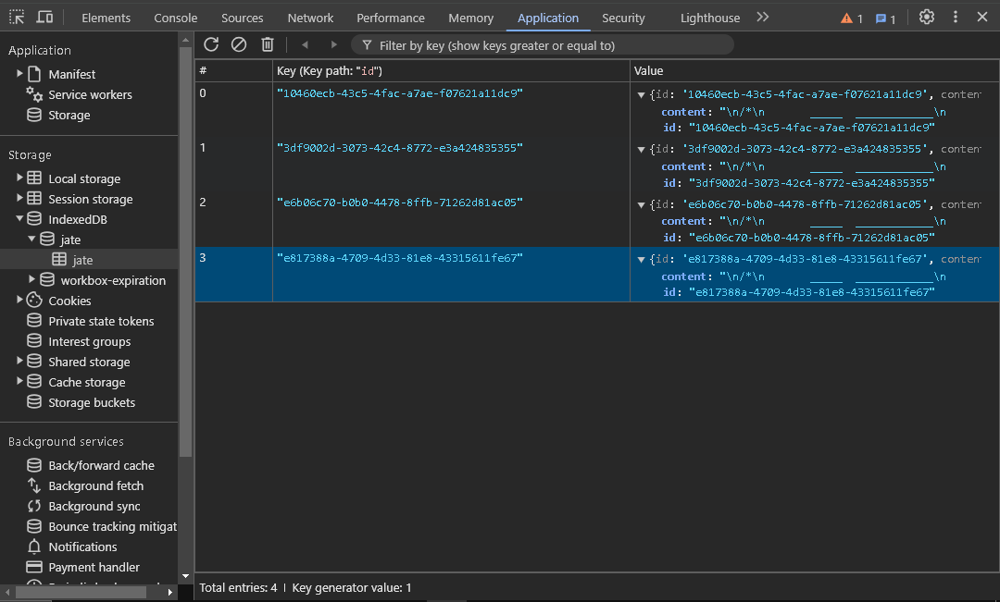
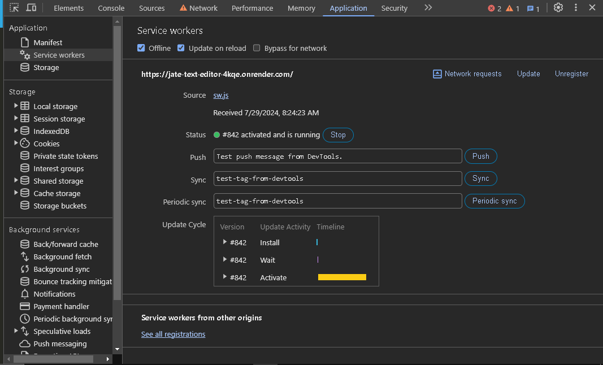
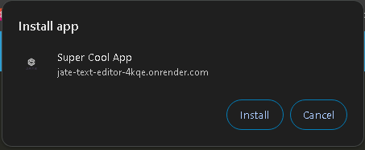
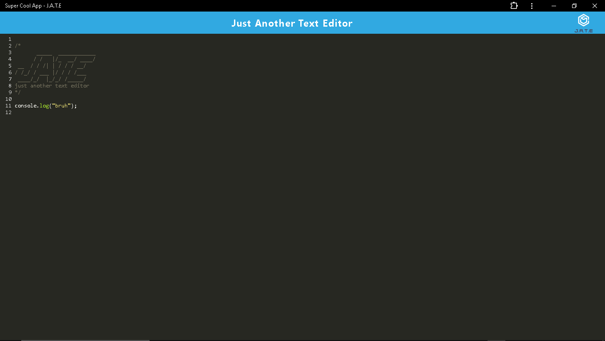

# JATE
  
  ## Description
  JATE is a text editor that allows the user to save text or code into the indexedDB on the local web browser. It can also be installed locally as a PWA.
  ## Table of Contents

  1. [Installation](#Installation)
  2. [Usage](#Usage)
  3. [License](#License)
  4. [Questions](#Questions)

  ## Installaion
  There is no installation required. Simply visit [JATE](https://jate-text-editor-4kqe.onrender.com) online.
  
  ## Usage
  
  Upon visiting the site, a console window will open in the browser. As you type your text or code, if you click anywhere outside of the text editor field, the app will automatically save the text to the indexedDB in the web browser.

  

  

  The web app employs the use of a service worker to pre-cache images and other assets to help the app load more quickly.

  

  The app can be installed onto the local machine to run as a stand-alone app. Simply click the "Install" button at the top to start the installation process.

  

  
  
  ## License
  This software uses the MIT License.
  ## Questions
  To see more projects or to contribute, please visit: [Flem-House-Dev](https://github.com/Flem-House-Dev).
